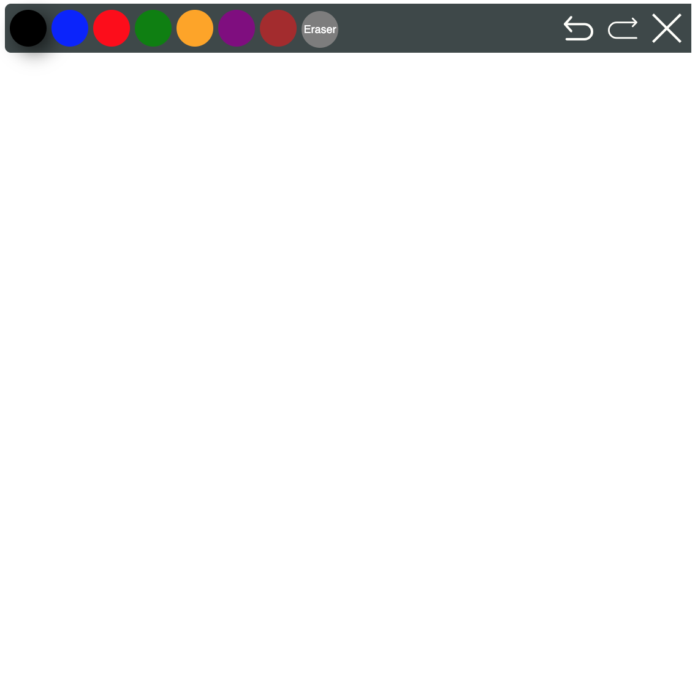

# opentok-react-whiteboard

React shared whiteboard that works with [Opentok](https://github.com/opentok/opentok-react)



Installation
----
npm:

`npm i opentok-react-whiteboard`

yarn :

`yarn add opentok-react-whiteboard`

or clone this repo.
## Example

```js
<OTSession
  apiKey={this.props.apiKey}
  sessionId={this.props.sessionId}
  token={this.props.token}
  eventHandlers={this.sessionEvents}
  onError={this.onError}
>
  <OTWhiteBoard />
</OTSession>
```

Demo
----
```
git clone https://github.com/MedElfadhelELHACHEMI/opentok-react-whiteboard.git
yarn
yarn run example
```

